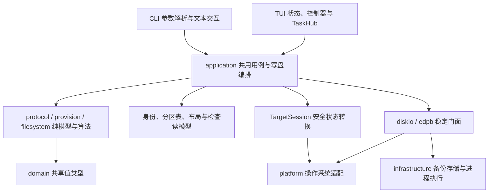

# edpcli 整体架构审计与优化方案

审计日期：2026-10-06（Asia/Shanghai）。代码基线：`8da83d2e73cdc2cba5270750ee43308a174b35c3`，版本 `2.5.0`。

实施状态：S0 已按本报告方案完成，见 [S0 实施与验证记录](20261006-architecture-s0-implementation.md)。S1–S4 的代码实施与宿主机目录基准已完成，见 [S1–S4 实施记录](20261006-architecture-s1-s4-implementation.md)。下文保留审计时基线事实；F9 的预算配置与强制 watchdog 已补齐；原生跨平台与物理 HIL 验收仍需单独完成。

## 结论

edpcli 已是有明确职责划分的模块化单体：协议解析、制盘规划、备份容器、平台适配和 CLI/TUI 共享用例都有实际实现，写盘安全与异步进度治理也具有相应测试。当前最值得投入的是强化安全能力边界、保留失败后的介质状态、解除具体依赖环，以及降低只读刷新成本。

建议继续保留单 crate，按下面的阶段推进。现有证据不足以支持全面重写、引入异步运行时或立即拆成大量 crates。文件拆分已经较充分；下一轮应以不变量、依赖方向和故障行为为验收目标。

本次确认了一个优先修复的运行逻辑缺口：官方制盘的分区格式化会丢失事务错误码，包括“回滚失败”的错误码，并继续处理后续分区。另两项 P1 是公开写入 API 的约束缺口与真实设备扇区大小的证据缺口，不能把它们表述成已经发生的物理错写。

## 审计范围与验证

检查了模块声明与导入、CLI/TUI 入口、写盘会话、制盘准备与提交、恢复事务、容器读写、目录快照、任务代次与进度运输、平台实现、架构门禁和 CI 配置；重点追踪了制盘、恢复与目录刷新三条调用链。

| 验证 | 本次结果 | 解释 |
| --- | --- | --- |
| 起始工作区 | 干净 | 审计未覆盖既有未提交改动 |
| `scripts/test-fast.sh` | 退出 0 | 格式、diff、Clippy、4 项 table-scroll 测试及 fast 套件通过；fast runner 为 4 suites / 6 artifacts，23.22 秒 |
| `python3 scripts/test-full.py --profile full --max-seconds 900` | 退出 0 | 8 suites / 10 artifacts，另含 doctests，0 failures，14.26 秒；使用当前编译缓存，不能视作冷构建基准 |
| 报告完成后的 `scripts/test-fast.sh` | 退出 0 | 报告变更路由到 3 suites / 5 artifacts，0 failures，7.60 秒；table-scroll 前置门禁也通过 |
| 纯内存事务故障注入 | 确认错误码投影丢失 | 事务错误码 6 投影成 `PartialFormatFailure` / 退出码 1，见 F1 |
| 平台 CI | 检查配置 | 主平台运行 full/Clippy/release，次平台编译；本次未查询远端执行结果 |
| 物理 USB / Virtual Disk HIL | 本次未执行 | 不将普通测试通过解释为真实设备验收通过 |

本次只新增本报告与 Git 忽略的会话进度日志，安装了仓库规定的本地 Git hook；未修改产品代码、提交、推送或替换用户安装的二进制。

测试输出：[fast 日志](/tmp/edpcli-architecture-20261006-fast.log)、[full 日志](/tmp/edpcli-architecture-20261006-full.log)。会话日志：[实时进度](/Users/zhangyuxi/Desktop/edpcli/audit/ai-progress/20261006-081511-manual.log)。这些日志及 `/tmp` 探针是本机证据，关键观察已写入本报告。

## 当前架构



图中表示主要职责与调用方向，不是完整依赖 DAG。当前仍存在门面之间的回边，详见 F4；许多纯领域逻辑仍合理地位于 `protocol`、`provision` 和 `filesystem`，不能仅凭 `domain/` 大小评价分层质量。

| 区域 | `.rs` 文件 | 物理行数 | 主要责任 |
| --- | ---: | ---: | --- |
| `src/tui/` | 185 | 39,169 | 五个功能工作区、交互状态、布局、后台任务与结果展示 |
| `src/application/` | 58 | 13,023 | 共享用例、会话、验证编排与结果模型 |
| `src/provision/` | 22 | 5,734 | 制盘规格、几何、写计划与区域处理语义 |
| `src/filesystem/` | 18 | 4,236 | 驱动、识别、空文件系统构造与只读分析 |
| `src/protocol/` | 23 | 3,615 | LBA、兼容协议、类型轴与跨 LBA 语义 |
| `src/platform/` | 7 | 2,641 | 三个平台的原生设备与安全操作 |
| `src/infrastructure/` | 5 | 994 | 备份存储适配与进程执行 |
| `src/domain/` | 4 | 372 | 几何、硬件、秘密值类型 |
| 全部 `src/` | 400 | 89,948 | 还包括根模块、CLI、检查器、容器与 diskio 等 |

统计包含注释、空行和内联/源树中的测试，不能解释成生产代码规模或代码质量分数。TUI 占约 43.5%；最近 60 个提交中，`tui/state.rs` 出现在 9 个提交、`application/provision.rs` 出现在 7 个提交，仅用于识别协作热点。

### 已有架构优势

1. **前端共享真实用例。** CLI/TUI 都通过 application 进行制盘与恢复。制盘覆盖 `ProvisionRequest::{Official, Plain}`，而非维护两套业务写入器。参见 [CLI 制盘入口](/Users/zhangyuxi/Desktop/edpcli/src/cli/commands/provision.rs:391) 与 [TUI 制盘任务](/Users/zhangyuxi/Desktop/edpcli/src/tui/provision/task.rs:219)。
2. **正常产品写入路径具有安全链。** USB/系统盘检查、卸载/锁卷、重开后身份复核、同步、读回和回滚均有实现。恢复还复用一次经过验证的备份字节快照，恢复后的评估与布局失败不会覆盖已经完成的恢复结果。参见 [恢复流程](/Users/zhangyuxi/Desktop/edpcli/src/application/write/restore.rs:150)。
3. **协议事实与 UI 展示已分离。** `protocol::semantic` 供不同消费者使用；profile 检测区分唯一结果、候选、缺上下文和未知，不强行推断来源。真实兼容协议不能作为“旧代码”随意删除。参见 [profile 检测模型](/Users/zhangyuxi/Desktop/edpcli/src/protocol/profile_detector.rs:32)。
4. **备份容器边界扎实。** EDPB 有结构、图关系、范围、哈希和资源预算校验。`VerifiedBackupReader` 保存同一文件句柄验证得到的不可变字节，避免消费阶段重新打开路径读取不同内容。参见 [验证快照](/Users/zhangyuxi/Desktop/edpcli/src/edpb/read.rs:14)。
5. **异步状态治理已有实质成果。** `TaskSlot` 支持代次淘汰、单任务执行与 latest 请求；来源密码域探测已携带 disk/session，并在结果路由和 UI 投递再次核对。前一轮审计中的旧探测串入新表单问题已不符合当前代码事实。参见 [任务结果路由](/Users/zhangyuxi/Desktop/edpcli/src/tui/provision/task_updates.rs:20) 和 [投递校验](/Users/zhangyuxi/Desktop/edpcli/src/tui/provision/runtime_updates.rs:11)。
6. **进度与副作用已有预算意识。** 高频扇区快照在入队前合并，普通诊断有内存限额及溢出日志；目录快照在同一刷新批次共享；进程执行包含 stdout 关闭后的截止时间。参见 [进度发布](/Users/zhangyuxi/Desktop/edpcli/src/tui/task_progress.rs:58)。
7. **工程门禁完整度较好。** fast/full、跨平台构建、协议金样、依赖策略与独立 HIL 有明确入口。模块行数已作为诊断而非硬性拆分指标，方向正确。

## 优先优化项

P1 表示应在下一轮涉及写盘的功能扩展前优先解决；P2 表示下一轮架构治理重点；P3 表示低成本治理。下面同时注明证据类型，避免将架构风险等同于已复现的物理设备故障。

### F1 · P1：格式化丢失介质中间态，并继续执行后续分区

**证据类型：错误码丢失已用纯内存探针复现；继续执行由控制流确认，未做真实盘故障注入。**

[事务执行器](/Users/zhangyuxi/Desktop/edpcli/src/diskio/transaction.rs:240) 将完整回滚与回滚失败分别表示为 `EXIT_ROLLED_BACK=7` 和 `EXIT_INTERMEDIATE=6`。但 [官方格式化循环](/Users/zhangyuxi/Desktop/edpcli/src/application/provision/commit.rs:282) 用 `result.map_err(|error| error.msg)` 丢弃 code，并对所有错误继续循环；[结果模型](/Users/zhangyuxi/Desktop/edpcli/src/application/provision.rs:264) 只保留 `Result<(), String>`，[状态投影](/Users/zhangyuxi/Desktop/edpcli/src/application/provision.rs:299) 将所有格式化失败映射为普通 IO 退出码 1。

纯内存探针调用当前 `execute_write_transaction`，注入写入及全部回滚失败，再按当前格式化结果转换构造 `ProvisionWriteOutcome`，得到：

```text
memory-only transaction code=6, write/rollback attempts=4,
projected status=PartialFormatFailure, projected exit=1
```

探针：[源码](/tmp/edpcli-architecture-20261006-error-probe.rs)。没有打开设备、执行平台安全操作或创建备份文件。此探针验证事务错误到报告的投影，不宣称回放了整个真实制盘提交流程。

**影响：** 普通格式化失败、已回滚和回滚失败对上层变成同一类失败。文本仍可能含中间态提示，但前端与脚本无法可靠据此控制下一步；后续分区没有针对中间态的停止条件。恢复后格式化也有 [Operation(error.msg)](/Users/zhangyuxi/Desktop/edpcli/src/application/post_restore.rs:389) 转换，宜一并治理。

**方案：** 结果中保留 `OperationError` 或专用 `TransactionFailure`，包含 code、阶段、分区和介质状态 `Unchanged / RolledBack / Verified / Intermediate / Unknown`。发生 `Intermediate` 或无法确认状态时停止后续介质写入，把未执行分区标成 `Skipped`；结果页明确保留“协议已提交”和“文件系统未安全完成”两项事实。普通失败是否允许继续，应成为显式策略，不能统一吞入字符串。

**验收：** 对首分区注入写失败、sync 失败、读回失败与回滚失败；回滚失败后后续分区的写次数必须为 0，CLI 保留退出码 6，TUI 显示中间态及必要处置。回滚成功仍准确保留码 7 和此前已提交阶段，不错误宣称整次操作回到初始状态。

### F2 · P1：512B 是写入假设，尚未成为真实设备前置证明

**证据类型：代码确认的证据缺口，未使用 4Kn 实体设备复现。**

[身份观察](/Users/zhangyuxi/Desktop/edpcli/src/media_identity_observer.rs:207) 直接设置 `logical_sector_size: Some(SECTOR as u32)`；[HardwareProbe](/Users/zhangyuxi/Desktop/edpcli/src/domain/hardware.rs:31) 没有实际逻辑扇区字段；[设备 guard](/Users/zhangyuxi/Desktop/edpcli/src/application/device.rs:19) 检查 USB/整盘和系统盘，但不检查真实扇区大小。[LCE 规划入口](/Users/zhangyuxi/Desktop/edpcli/src/application/provision/prepare.rs:64) 将常量 512 传给几何验证器，而不是探测值。

macOS/Windows 的容量入口用字节数除以 512；Linux 读取 sysfs size。它们目前给出的是现有模型使用的容量单位，不能代替逻辑扇区大小证明。纯 LCE helper 已有拒绝 4096 的测试，但真实调用没有把这项设备事实传进去。

**影响：** 不支持介质未必能在打开写权限前得到一致、明确的拒绝，且身份 pin 中的扇区大小证据被常量替代。当前写接口还有 `u32` LBA 和 512B sector 限制；检查器的 `u64` 只读支持不代表写入容量范围同步扩大。

**方案：** 平台统一返回 `ObservedDeviceGeometry { capacity_bytes, logical_sector_bytes, physical_sector_bytes, ... }`，区分容量字节数、512B 协议地址单位与设备逻辑块。未知逻辑块大小和非 512B 目标在真实写入口明确拒绝；重开后重新观察并核对几何。保留现有 EDP 协议的 512B 合约，先加强拒绝，不扩大到 4Kn 写入支持。

**验收：** 三平台 fake/native 适配覆盖 512、4096、未知、非整除容量及重开后几何变化。初次观察已不支持的用例不得到达卸载/写权限切换；重开后发生几何变化的用例写次数为 0。容量边界覆盖 `u32` 上限和尾部工件。真实 HIL 结果记录设备探测值，不能填入默认常量。

### F3 · P1：安全流程存在，但公开 API 尚不能强制它成立

**证据类型：接口及调用链确认；未发现当前 CLI/TUI 绕过检查。**

[TargetSession](/Users/zhangyuxi/Desktop/edpcli/src/application/target_session.rs:28) 持有 runner、disk 和 guard，不持有 `SectorDev`；`reopen_and_verify` 接收调用者传入的设备与验证闭包。成功后，写入器仍接受独立的 `&mut dyn SectorDev`，没有要求提交 `WriteLocked` 能力。

[公开 commit_provision_on_disk](/Users/zhangyuxi/Desktop/edpcli/src/application/provision.rs:626) 直接打开设备并提交，未核验强制备份；备份及 pin 验证位于另一 [高层入口](/Users/zhangyuxi/Desktop/edpcli/src/application/provision.rs:810)。低层提交函数和裸设备/事务函数仍公开。正常 CLI/TUI 使用高层入口，有额外架构门禁保证当前调用点，但未来调用者可以使用绕过强制备份的公开 API。

准备计划也并非完全不可变：[PreparedNewProvision](/Users/zhangyuxi/Desktop/edpcli/src/application/provision.rs:383) 和 Plain 准备结果有公开可修改的 disk、写计划、格式化目标等字段。现有提交验证会捕捉多种不一致，但依赖运行时复核，且容易增加后续维护负担。

**方案：**

- 将真实设备句柄、目标 pin 与锁定 guard 绑定到同一会话；会话提供真实写能力，事务执行不能从任意会话外设备得到该能力。
- 增加不可公开构造的 `BackedUpPreparedProvision`，由“创建、落盘、验证来源备份”的步骤生成；真实制盘提交只接受它。
- 收紧准备结果字段，提供只读 getter 与展示 DTO；修改请求后重新 prepare，不直接修改准备结果。
- 镜像导出和纯内存故障测试保留独立入口。旧 Rust API 应按现有集成清单迁移/弃用；crate `publish=false` 不意味着无需评估外部源码调用者。

**验收：** 编译失败测试证明 `ReadOnly` 会话不能调用真实写入、未备份计划不能提交；内存测试不需要假冒真实备份证明。运行时继续覆盖备份失败、换盘、重开失败和锁定生命周期，并维持既有 CLI/EDPB 兼容合约。

### F4 · P2：稳定门面回边使依赖倒置仍不完整

**证据类型：直接导入确认，属于模块环，不是 Cargo package 依赖环。**

[application::ports](/Users/zhangyuxi/Desktop/edpcli/src/application/ports.rs:1) 目前只有三个旧接口的再导出，没有独立定义需要的设备生命周期、备份存储等能力。以下回边仍存在：

| 回边 | 证据 | 优先拆出的责任 |
| --- | --- | --- |
| `diskio → backup_store → diskio` | [存储门面](/Users/zhangyuxi/Desktop/edpcli/src/diskio/backup_catalog.rs:2) 与 [存储实现 glob 导入](/Users/zhangyuxi/Desktop/edpcli/src/infrastructure/backup_store/catalog.rs:2) | 目录 DTO、Clock、存储契约与块设备契约分开 |
| `filesystem → backup_metadata → filesystem` | [analysis 导入](/Users/zhangyuxi/Desktop/edpcli/src/filesystem/analysis/mod.rs:3)、同模块 `probe_filesystem` 调用，以及 [备份探测实现](/Users/zhangyuxi/Desktop/edpcli/src/backup_metadata.rs:204) | 几何从 domain 直接导入；文件系统探测归 filesystem，备份采集调用它 |
| `platform → sysinfo → platform` | [平台接口](/Users/zhangyuxi/Desktop/edpcli/src/platform/mod.rs:123) 与 [CmdRunner 及平台适配](/Users/zhangyuxi/Desktop/edpcli/src/sysinfo.rs:14) | 中性命令执行接口与设备探测接口分开，避免 CmdRunner 同时承担两者 |

**影响：** 将来单独编译、测试或复用某个区域，需要连带旧门面；职责提取会触动多处 glob 导入。仅继续移动目录不能解除这种耦合。

**方案：** 先迁移实现层依赖，保留外部门面单向再导出。为确实有副作用、生命周期或故障注入需求的边界定义窄接口；纯算法直接调用，不为每个函数新增 trait。`SectorDev` 中的读、写、重开能力逐步分离，真实设备的 sync 不采用测试方便用的默认空实现。

**验收：** 上述三条具体回边消失；基础实现不再导入其对外门面；领域/端口定义没有前端或 OS 副作用依赖；原集成 API 与对应套件通过。达到这些条件后再评估是否有必要抽一个纯核心 crate。

### F5 · P2：目录扫描约束了驻留数据，未约束累计 I/O 和过期任务成本

**证据类型：读取路径确认，未测量大目录实际延迟。**

[目录扫描](/Users/zhangyuxi/Desktop/edpcli/src/infrastructure/backup_store/catalog.rs:290) 有 4096 条目和 64MiB 展示数据预算，同批次 `CatalogSnapshot` 避免重复扫描，这是有效改善。但每个新刷新仍通过 `VerifiedBackupReader::open` 验证工件并 [再次计算全文件 SHA-256](/Users/zhangyuxi/Desktop/edpcli/src/edpb/read.rs:193)。无效文件还可能走额外摘要路径。单容器上限为 256MiB，目录预算不等于累计读取量预算。

`TaskSlot` 会淘汰旧结果，并等待正在运行的扫描结束后启动最新请求；当前扫描实现没有读取循环中的取消检查。因此 UI 保持响应，不代表更新结果能及时到达。

**方案：**

- 展示扫描增加跨刷新缓存与分阶段结果，缓存键包括路径、文件身份、长度和修改信息；健康状态注明是否为缓存/待复验，不能把缓存显示结论当作写入或删除授权。
- 恢复、删除与提交前继续重新验证具体文件和目标。精确选定文件的命令尽量复用当前 `scan_backup_file` 能力，避免扫描所有兄弟文件。
- 只读扫描增加取消 token、累计字节/耗时预算及明确的未完成状态；不截断后重新生成可操作的全局编号。取消不能套用到正在关键写入的事务上。

**验收：** 用 10/100/1000 个正常及损坏容器记录刷新 P50/P95、实际读取字节、RSS 和取消响应。缓存命中后的读取量随变化文件增长；取消后过期读取尽快停止；同名同尺寸替换文件即使在展示缓存中陈旧，执行恢复/删除仍必须重新验证并拒绝冲突。

### F6 · P2：架构测试同时存在文本耦合和目录覆盖缺口

**证据类型：测试代码确认。**

[architecture_split.rs](/Users/zhangyuxi/Desktop/edpcli/tests/architecture_split.rs:1) 共 1834 行，其中 78 个 `fs::read_to_string` 调用表达式与 5 个 `include_str!`；另有循环扫描，所以这些数字不是实际文件读取次数。部分门禁对函数名、调用字符串、文件位置和字段排列做断言，能阻止已知回退，但不足以证明语义正确，并会使合理重命名/提取同步修改大量测试。

更直接的覆盖缺口：[domain 依赖检查](/Users/zhangyuxi/Desktop/edpcli/tests/architecture_split.rs:918) 扫描 provision/protocol，却没扫描新 `src/domain/`；[infrastructure 检查](/Users/zhangyuxi/Desktop/edpcli/tests/architecture_split.rs:1465) 扫描 diskio 和若干根文件，却没扫描 `src/infrastructure/` 及整个 `src/edpb/`。其他定向测试提供部分保护，但上述分层门禁并不完整覆盖其命名所称的层。

**方案：** 先扩展全目录覆盖并自动发现模块，再把导入检查升级为能处理别名、嵌套 use、重导出、`super` 和 `#[path]` 的模块依赖检查。保留必要的协议字节、事务顺序、安全调用点和文档契约；展示行为用 TestBackend/状态回放验证，写安全用故障注入和能力编译失败测试验证。

**验收：** 在新 domain/infrastructure/edpb 子模块中注入非法依赖，门禁必须失败；仅改无行为变化的函数名或移动内部文件，行为测试仍通过。新增分区回滚失败停止链测试覆盖 F1，不能只新增“源码含某 token”的断言。

### F7 · P2：进程执行边界缺少统一诊断结果与 Windows 子进程树收尾

**证据类型：平台条件分支确认，未在 Windows 注入进程树故障。**

[进程执行器](/Users/zhangyuxi/Desktop/edpcli/src/infrastructure/process.rs:79) 具有截止时间、8MiB stdout 预算、Unix 进程组和非阻塞读取。当前 stderr 直接丢弃；[terminate](/Users/zhangyuxi/Desktop/edpcli/src/infrastructure/process.rs:61) 的进程组终止只在 Unix 下启用，Windows 仅有直接 child kill。这里的回归测试也受 `#[cfg(all(test, unix))]` 限制。

**影响：** 权限、卸载或探测命令失败时可操作诊断不足；跨平台“超时后无遗留进程”的契约不一致。未观测到实际遗留进程，不能据此宣布 Windows 存在已复现泄漏。

**方案：** 中性 `CommandOutcome` 保留状态码、耗时、stdout、有限 stderr 摘要及截断标记，两个输出流并行排空并共享预算；Windows 实现进程树生命周期约束；提权交互与普通短命令分别声明期限。新增 Windows 原生测试，与 Unix 测试覆盖相同的关闭 stdout、继承管道和超时场景。

**验收：** 超时后受控子进程树结束且句柄释放；仅 stderr 输出不会死锁；超量输出有确定结果；诊断不记录秘密参数。实际设备写任务不得因诊断日志失败而失去安全收尾。

### F8 · P2：TUI 已拆状态，但用例契约仍夹带交互与文本

**证据类型：模型与调用链确认，属于演进成本问题。**

`AppState` 已只持有 shell 加五个工作区状态，TaskHub 也有专用 provision 子状态，不能继续把它们描述成完全未拆分的“大状态对象”。残余热点是 feature 行为仍经许多 `impl AppState` 和全局路由协调；另一方面，[恢复用例](/Users/zhangyuxi/Desktop/edpcli/src/application/write/restore.rs:80) 包含交互选择循环与提示语，[ProvisionWriteOutcome](/Users/zhangyuxi/Desktop/edpcli/src/application/provision.rs:328) 直接生成 UI 摘要文本。读写器还存在多种 u32/u64、Vec/固定数组和错误表示适配。

**方案：** 把备份选择/确认适配留在前端或兼容入口，核心用例接收结构化请求、授权事实与进度 sink，返回结构化结果。授权后的重开身份检查仍留在 application，不下放到 UI。TUI 每个功能逐步拥有自己的输入、状态转换、任务投递和呈现，shell 只负责跨工作区导航、全局 notice 和关键写入退出策略；按实际变更热点迁移，不继续按行数拆文件。

**验收：** CLI/TUI/内存调用使用同一核心请求与结果；改变提示文字不改业务决策；无需构造完整 AppState 即可测试功能状态转换。延迟返回、换盘、连续切换、窗口尺寸变化及关键写入退出请求行为保持一致。

### F9 · P3：架构文档的门禁预算已落后于实现

[架构文档](/Users/zhangyuxi/Desktop/edpcli/docs/architecture/ARCHITECTURE.md:52) 写 fast 45 秒、CI 120 秒；[fast 脚本](/Users/zhangyuxi/Desktop/edpcli/scripts/test-fast.sh:21) 默认 60 秒，CI 主门禁为 180 秒。还需要区分“耗时回归判定阈值”和“强制执行截止时间”：`--max-seconds` 在运行结束后判定超预算，编译/doctest 的 `run_text` 没有同一总期限，fast 脚本前置检查也在 runner 计时区间之外。

**方案与验收：** 用单一配置生成/校验文档中的默认值，明确各阶段计时范围和超时性质；编译、测试二进制、doctest 与任务总 watchdog 分别有可观察退出原因。慢编译/卡住子进程的测试验证总期限，不能仅检查源码出现数字。

## 事务保证与产品边界

现有写事务是“同步、读回及失败后尽力完整回滚”，不是硬件提供的跨扇区原子事务。[回滚镜像](/Users/zhangyuxi/Desktop/edpcli/src/diskio/transaction.rs:276) 位于内存中，掉电、进程被强制终止或介质永久失联时不能依靠该镜像自动恢复。当前源码已经明确说明严格原子不可得，这项限制不应因为函数叫 `atomic_write_*` 被隐藏。

官方制盘先提交协议，再逐分区格式化，阶段级成功与整次操作成功是两个事实。元数据备份不是文件备份，不能承诺恢复格式化前的用户数据。优化错误模型时，应准确报告已提交阶段、已回滚范围、未执行范围和未知介质状态。

后续如需提升崩溃可追溯性，可先记录有界的宿主机操作阶段与备份关联信息，供重启后提示重新检查身份与介质；不要把没有验证的状态标成成功，也不要自动继续破坏性写入。完整持久化回滚前镜像属于另一个设计决策，可能保存旧数据，不能顺带改变现有 `metadata_only` EDPB 合约。

## 建议目标与落地顺序

目标保留 `frontend → application` 的现有主结构，application 编排并消费中性副作用能力；protocol/provision/filesystem 直接使用纯模型；infrastructure/platform 实现这些能力；兼容门面只单向再导出。优先提取以下边界，而不是一次创建大量抽象：

| 能力 | 持有/返回什么 | 禁止隐含的行为 |
| --- | --- | --- |
| 真实目标会话 | 同一设备句柄、身份/几何证据、锁定 guard | 会话 A 的授权去写会话外设备 B |
| 已备份制盘计划 | 不可变写计划、来源 pin、已验证备份证明 | 任意准备结果直接进入真实提交 |
| 只读目录刷新 | 展示快照、验证状态、预算/取消结果 | 将缓存展示结果当作恢复或删除授权 |
| 命令执行 | 有界双流输出、状态和耗时 | 丢掉全部 stderr、超时后保留受控进程树 |
| 事务结果 | 阶段、错误类别、回滚结果、介质状态 | 把中间态退化成普通字符串错误 |

| 阶段 | 范围 | 完成标准 |
| --- | --- | --- |
| S0：修正失败语义 | F1；同步整理 F9 文档 | 中间态停止后续写入，错误码及已完成阶段完整贯穿 CLI/TUI；fast/full 通过 |
| S1：证明写入前置条件 | F2、F3，拆成几何探测/计划不可变/会话能力三个可审查改动 | 不支持几何在写准备前拒绝；真实提交需要备份证明；句柄与 guard 绑定；集成 API 迁移明确 |
| S2：解除已确认的依赖环 | F4、F6；逐环提交，不大规模搬目录 | 三条回边解除；新层全目录受门禁约束；相关行为与编译失败测试生效 |
| S3：优化读取与诊断 | F5、F7 | 有实测刷新成本、取消响应与跨平台进程树测试；缓存不影响安全授权 |
| S4：降低前端演进成本 | F8；依据热点逐功能迁移 | CLI/TUI 用同一核心请求/结果；功能状态可独立测试；不为减少文件行数重构 |

S0/S1 是发布敏感变更，应在隔离测试中充分故障注入，随后按仓库六个物理 HIL 场景及本报告建议补充的几何拒绝场景验收；记录对应 commit、设备实际几何、断言和证据。先执行虚拟/内存验证，再以明确授权的物理介质验证；本次审计没有执行这些破坏性场景。

## 验证策略

- 每个局部改动使用 `scripts/test-fast.sh`；公共写入契约、依赖方向与跨模块重构完成后执行 `python3 scripts/test-full.py --profile full`。长验证使用至少 600 秒的外部执行预算并观察同一任务至退出；脚本内部的耗时阈值不代替外部截止时间。
- 格式化/提交前运行 `cargo fmt --all`，保留仓库 hook 和 CI fmt 检查；相关 Clippy、release 与平台检查沿用现有 CI，不增加每次重复全量检查的负担。
- 协议或物理分区语义修改继续经过金样、byte ledger 和文档契约；不得以测试简化为由删除真实协议兼容分支。
- 几何拒绝、回滚失败停止链、换盘、过期结果、缓存替换和进程树收尾新增行为测试；现有快照与源码断言不能替代这些失败路径。
- 目录缓存与读取优化先建立基准；本报告没有提供未经实测的性能提升百分比。物理 HIL 与虚拟 CI 分开记录，当前 full 通过只说明本机非 HIL 门禁通过。

投入顺序应是：失败后的介质状态 → 真实几何与写能力证明 → 单向依赖和有效门禁 → 读取效率与诊断 → 前端功能自治。这个顺序优先降低错误恢复和后续扩展风险，并保留已经验证的协议、容器和产品交互成果。
