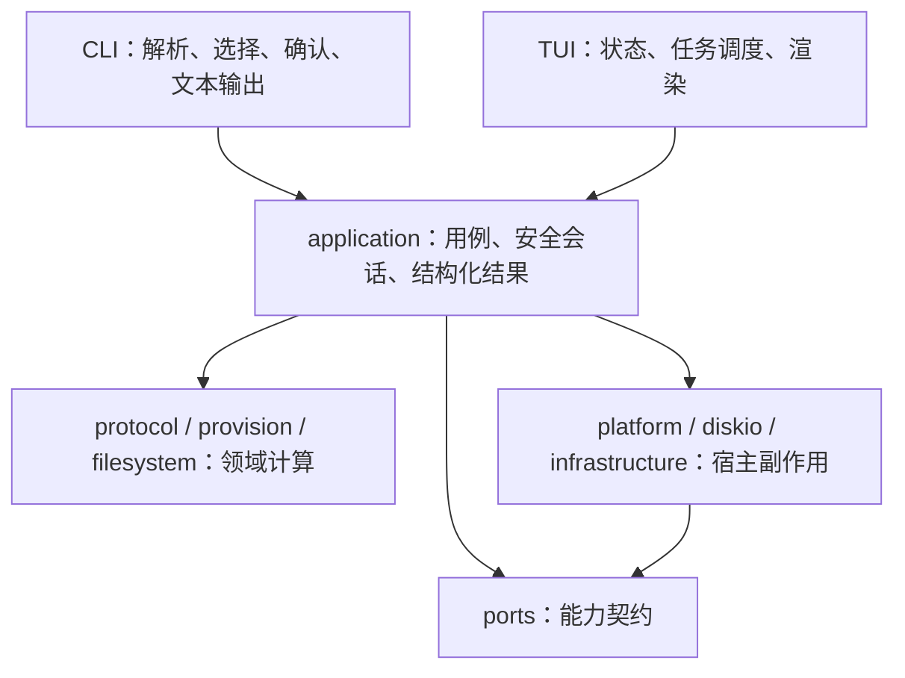

# edpcli 架构与持续冗余治理审计

审计日期：2026-10-07。基线提交：`6b56da5e9508a18939ffa167c2115bb3e45e8dc1`，分支 `main`。本次读取的是带已有未提交修改的工作区，不是该提交的干净快照。本文记录核查结论与后续建议；当前正式架构仍以 [架构文档](../../docs/architecture/ARCHITECTURE.md) 为准。

**结论：可以继续工程化，也可以继续治理冗余。现有安全链和分层已经有较强基础；下一轮的收益主要来自接口职责、前端业务投影和持续门禁。** 本次没有确认可直接删除的业务代码，也没有执行业务重构。

## 1. 当前结构与关键调用链



这是职责示意图，不是完整依赖图。`application` 当前也直接调用具体宿主实现；不能据此宣称完全依赖倒置或全仓无环。

| 部分 | 当前职责与核查入口 | 工程化判断 |
| --- | --- | --- |
| 前端 | [CLI 制盘入口](../../src/cli/commands/provision.rs)、[TUI 制盘任务](../../src/tui/provision/task.rs) 共用 prepare/commit/export | 不需要重建两套用例服务 |
| 用例与安全链 | [制盘服务](../../src/application/provision.rs)、[写服务](../../src/application/write.rs)、[TargetSession](../../src/application/target_session.rs) | 核心安全状态集中，继续保持单一归属 |
| 协议与领域 | [协议语义](../../src/protocol/semantic.rs)、[制盘领域](../../src/provision/mod.rs)、[文件系统驱动](../../src/filesystem/driver.rs) | 纯计算可复用，领域模型不限于 `domain/` 目录 |
| 设备和存储 | [能力接口](../../src/ports.rs)、[平台边界](../../src/platform/mod.rs)、[事务](../../src/diskio/transaction.rs)、[备份存储](../../src/infrastructure/backup_store/mod.rs) | 设备能力仍混合命令执行、观察和句柄状态，需要渐进解耦 |
| 读模型与门面 | [application 根模块](../../src/application.rs)、分区表、介质身份、磁盘布局等根模块 | 目前可隔离前端导入，后续应明确模型所有者和最小导出集合 |
| 质量体系 | [AST 依赖检查](../../tests/architecture_dependencies.rs)、[职责契约](../../tests/architecture_split.rs)、fast/full、协议金标、独立 HIL | 已有可用护栏；冗余审计还需进入持续执行入口 |

真实制盘的共享调用链：

```text
CLI / TUI
  → prepare_provision_on_disk：只读观察、来源/密钥/几何校验、生成计划
  → commit_provision_with_backup_on_disk_with_progress
      → 当前目标元数据备份
      → 来源绑定与摘要验证，构造 BackedUpPreparedProvision
      → 提交前再次验证备份
      → TargetSession：ReadOnly → PreparedWrite → WriteLocked
      → 协议事务：保存原扇区 → 写入 → 同步 → 读回；失败回滚
      → 对选中分区逐一格式化；首个失败停止后续分区
      → 类型化执行状态、分区结果、警告和写后记录
```

协议事务与后续各分区格式化是不同事务范围。一个分区回滚成功不意味着已提交协议和之前格式化的分区也撤销；[执行状态](../../src/application/provision.rs) 和 [介质状态](../../src/application/error.rs) 已表达这个区别，应作为后续重构验收不变量。

源码规模：`src/` 中 399 个 Rust 文件、92,069 行；包含注释、空行与内部测试，不能当作生产逻辑行数。TUI 为 184 个文件、39,841 行，约占 43.3%；application 子目录为 57 个文件、13,898 行，不含根 `application.rs`。`AppState` 为 1,149 行、制盘服务根为 1,032 行、Windows 平台为 1,076 行。这些数字用于定位职责核查，不能单独证明冗余或强制拆文件。

## 2. 优先改进项

### P1：明确工程脚本的 Python 契约

本机默认 `/usr/bin/python3` 是 3.9.6。直接运行 `scripts/test-fast.sh`，格式、diff、Clippy 和表格滚动前置检查通过，但工程脚本测试在 `import tomllib` 处失败。已有 Python 3.11.15 可通过；本轮仅在忽略目录 `target/architecture-review-tools/` 建立临时 `python3` 链接并为该次进程调整 PATH，没有改变全局环境。

`scripts/ci/build_config.py` 和 `scripts/tests/test_engineering.py` 直接依赖 `tomllib`，需要 Python 3.11+。建议统一说明最低版本，增加入口版本预检；CI 显式选定受支持版本，避免依赖 runner 默认值。不要在门禁运行到中间时才暴露模块缺失。

验收：3.9 在启动时返回明确版本提示；支持版本可运行 fast/full 与构建事实脚本；macOS/Linux/Windows 的文档和 CI 使用同一版本要求。

### P1：让全仓冗余审计持续执行，并维护候选处置

[Makefile](../../Makefile) 已提供 `make audit`，但本轮检查 `.github/`、fast/full 和 watchdog，没有发现生产全仓审计命令接入。full 中运行的工程脚本行为测试会验证检测器规则，不能替代对当前文件集执行全部规则。

建议在 CI 的仓库契约流程加入 `python3 scripts/audit-redundancy.py --check`，并覆盖 Rust、文档和脚本变化。报告可以作为 CI artifact 保存。`--check` 的当前语义应保留：确认问题导致失败，候选不自动导致失败。

处置清单应按 `rule + path + subject` 跟踪，附证据、结论及重新核查条件。新候选或证据变化要求复核；不能只比较候选总数。确认退役后按原用途加入退役规则。发现新类别时扩展全仓检测器并加行为回归，随后重扫全仓。

验收：任何受检查文件变化都会触发全仓审计；故意引入断链、缺失模块或退役入口会导致门禁失败；安全接口、协议证据和测试适配不被自动删除。

### P2：把界面业务投影收敛到应用边界

[TUI preflight](../../src/tui/provision/preflight.rs) 已让预览与提交前校验共享一个决策源，并调用 `PreserveAssessment` 等共享能力。但必需格式化、目标密码要求和部分结果投影仍由 `AppState` 计算。[结果快照](../../src/tui/provision/result_model.rs) 也从 prepare 结构判断保留区域的文件系统含义。

建议逐步提取中性、类型化的规划评估和结果投影：输入来源画像、目标几何及用户选项，输出区域处置、必需操作、阻断原因及可展示事实。TUI 留下编辑状态、输入修订号、异步结果代次、焦点与中文提示；CLI 和其他前端消费相同决策。提交阶段继续重新校验，不能把 UI 的只读预判当作写入授权。

[TaskHub](../../src/tui/task.rs) 当前管理 OperationId、关键 worker 等待和 single-flight。这对当前终端前端合理；若增加其他长期运行前端，再提取共享操作生命周期。TaskHub 的单任务控制是进程内机制，不能替代平台锁；本轮没有据此认定存在跨进程写入缺陷。

验收：同一来源与请求在 CLI/TUI 得到相同区域策略和最终状态；密码更改使旧结果失效；关键写任务的退出等待和失败后重新检查要求保持。

### P2：分离设备能力与宿主命令能力

[CmdRunner](../../src/ports.rs) 同时承担命令执行、硬件观察、序列号和几何获取；`SectorDev` 同时暴露读取、写入、sync 和 reopen。`TargetSession` 直接持有平台 `WriteGuard`，并调用 `platform::system`。[设备服务](../../src/application/device.rs) 直接构造 `FileDev`。当前测试替身因此仍需模拟部分宿主命令和设备编号语义。

建议先围绕“设备观察 + 只读打开 + 独占写租约”建立窄接口，用平台适配器提供实现；命令执行留给宿主基础设施。事务仍只能经验证后的锁定会话执行。读写能力拆分可逐步实施，不必一次重写所有设备接口。

需要严格保留的条件：未知几何拒绝写入；卸载前和 reopen 后复核；身份 pin 绑定；独占借用与 guard 生命周期；sync/读回/回滚；制盘前验证备份证明。不能为方便抽象引入“默认允许”实现。

验收：至少一个完整写用例能用内存设备和故障注入完成安全链，不依赖真实设备路径或 `diskutil` 字符串；桌面平台适配继续通过原安全测试。宽范围改动运行 full，硬件验收保持独立。

### P2：明确 API 所有权，收紧通配导出和测试便捷入口

application 多个文件使用 `pub use crate::…::*`，`support/filesystem/metadata` 也通配导出。它们不是复制实现，当前确有隔离前端路径的作用；但导出范围会随着内部实现自动扩大。[lib.rs](../../src/lib.rs) 与架构测试还固定部分根门面，因此修改时需同步评估现有契约。

建议先列出由 CLI、TUI、示例、HIL 和集成测试消费的最小能力，再改为显式导出。纯硬件/几何类型已有 domain 所有者，其他读模型和策略按职责逐步确定所有者；移动实现时不再复制第二份。测试便捷包装可以在测试改用实际生产入口后缩小可见性或移入测试支持。

不要批量把 `pub` 改成 `pub(crate)`：集成测试作为外部 crate，需要设计替代测试入口；“只在测试调用”也可能是协议金标、事务故障注入或编译期安全契约。

验收：业务实现只有一个归属路径；新增内部 helper 不自动扩大前端 API；示例、HIL 与行为测试仍覆盖生产实现。

### P3：按资源需求演进写计划与验证

[SparseFilesystemImage](../../src/filesystem/image.rs) 使用 `BTreeMap<u64, [u8; 512]>` 物化扇区；[格式化计划](../../src/application/provision/format_plan.rs) 同时保留物理镜像与验证镜像；[共享格式化执行器](../../src/application/filesystem_format.rs) 再构造事务数据，事务还保存原扇区以便回滚。它是稀疏模型，但并非固定内存模型。

建议先建立格式化资源预算和可观测统计，再根据大盘或嵌入式要求改成可重复生成的扇区源与有界恢复存储。不能以删除镜像或原扇区缓存的方式削弱读回和回滚。此前的 [内存探针](20261007-mobile-esp32-format-memory.csv) 可作为方向证据，本轮没有重测峰值内存。

当前底层事务确实逐扇区物理读回；[深度文件系统验证](../../src/application/provision/commit/partition_format.rs) 则使用准备好的明文镜像。若改成流式生成，应评估从真实介质经解密映射验证文件系统，使生成校验与介质校验继续闭合，不能描述为当前完全没有读回。

## 3. 180 条冗余候选的处置

初次执行全仓 13 条规则，扫描 732 个文件，其中 Rust 文件 519 个；确认问题 0，候选 180。候选涉及 175 个不同的 `path + subject`，少数接口同时命中转发与仅测试规则，不能把它们累加当作 180 段独立代码。

| 规则 | 命中 | 本轮处置 |
| --- | ---: | --- |
| 单次转发接口 | 92 | 33 条在平台模块，22 条在 TUI；分别核对平台分发、语义入口及便捷包装职责，保留边界职责，少量入口排入后续迁移评估 |
| 仅测试消费者 | 60 | 保留协议、事务、故障注入和公开构造能力；便捷包装可先迁移测试再缩减 |
| 被忽略参数 | 25 | 平台实现与协议轴检测共用接口；本轮保留，不能按未读取参数判定安全校验失效 |
| 无普通执行引用的 API | 2 | 保留备份证明构造与提交入口，详见下文 |
| 仅测试消费者的声明 | 1 | `EDPF_TABLE_LEN` 为协议表契约，保留 |
| 未注册源码、缺失模块、断开文档链接、旧测试目标、重复文档、退役符号复现等 | 0 | 未发现确认问题 |

本轮逐项对照当前规则、路径、符号与证据，发现与 [先前处置清单](20261007-mobile-esp32-redundancy-disposition.tsv) 完全相同；据此保留有效处置，重点补充了安全接口与便捷包装的职责判断。新 [处置清单](20261007-engineering-redundancy-disposition.tsv) 覆盖全部 180 条。未对每条候选执行独立的动态可达性证明；清单中的“后续评估”不是已确认冗余。

下一轮可按独立范围处理：

| 对象 | 已验证事实 | 后续行动 |
| --- | --- | --- |
| `plan_format_targets` | 仅测试使用的 String 错误包装；`plan_format_targets_typed` 提供类型化入口 | 将测试迁移到 typed 入口，确认其他消费者后收缩包装 |
| `AppState::begin_write_wizard` | 默认 `expected_identity = None` 的包装仅有测试消费者；运行时调用 `begin_write_wizard_for_identity` | 测试显式调用实际入口，随后评估去掉便捷包装；保持身份授权行为测试 |
| `scan_disks` | 内部模块的包装仅有测试消费者；应用服务使用 `scan_disks_with_catalog` | 让扫描测试覆盖当前目录快照入口，确认并发/编号行为后决定移入测试支持或删除 |
| `format_partition_on_disk` | 无密钥参数的便捷入口仅由格式化安全测试使用 | 与真实生产编排入口对照后迁移；不能直接删掉安全测试或仅靠删除包装让报表下降 |
| `backup_prepared_provision_on_disk` / `commit_provision_on_disk` | 无普通执行引用，但组成来源绑定备份证明和提交的公开能力；含编译期使用契约 | 本轮保留；如未来统一 API，先保留等价证明构造和授权链，再有意调整公开边界 |

没有新增冗余类别：本轮新判断集中在依赖方向、业务投影、API 归属和工程环境；现有候选均由既有规则覆盖。若后续确认新的重复模式，仍需按仓库约定扩展检测器，而不是只做局部搜索删除。

## 4. 建议推进顺序与验收

1. **工程环境与持续审计**：Python 版本契约、CI 全仓审计、候选处置更新条件。收益明确，较少触及业务。
2. **便捷包装与显式导出**：从上述小范围对象开始，先迁移消费者，再删或收缩；退役规则和行为回归一起提交。
3. **中性 preflight 与结果投影**：让界面消费同一业务事实，减少后续前端演进时的重复规则。
4. **设备观察和写租约接口**：保持 TargetSession 类型状态与完整安全链，引入内存适配验收。
5. **按实际需求拆 crate 或流式化**：当独立编译、其他前端或资源预算确有要求时推进。当前单二进制不需要为了层数创建大量 crate。

每个步骤控制为可独立审查的改动；日常 fast，合并/发布或宽范围重构 full，协议金标与虚拟/真实 HIL 分别按适用范围执行。验收关注行为保持、API 收缩、依赖约束与资源预算，不能只追求文件数、行数或候选数量下降。

## 5. 本轮验证与范围

- 初次全仓冗余审计通过：732 个文件、13 条规则、确认问题 0、候选 180；逐项与旧清单的键和证据匹配。
- fast 首次被系统 Python 3.9 的 `tomllib` 缺失阻塞；改用本机已有 Python 3.11.15 后通过。格式、diff、Clippy、脚本行为、表格滚动和所选普通套件通过；8 个 suite / 10 个 artifact / 0 失败，runner 用时 34.78 秒。
- 已按仓库约定安装本地 Git hook：`core.hooksPath=.githooks`。
- 新增两份审计产物后重跑全仓审计：734 个文件、13 条规则、确认问题仍为 0、候选仍为 180。处置清单的唯一键、完整覆盖和非空结论检查通过；文档契约 7 项通过，`git diff --check` 通过。
- 本轮只新增报告和处置清单；未修改已有业务代码、规范或先前审计产物，没有提交、安装二进制、发布或执行 HIL。没有执行 broad refactor，也没有额外运行 full；fast 验证的是当前带已有修改的工作区，不构成跨平台或实盘验收。
