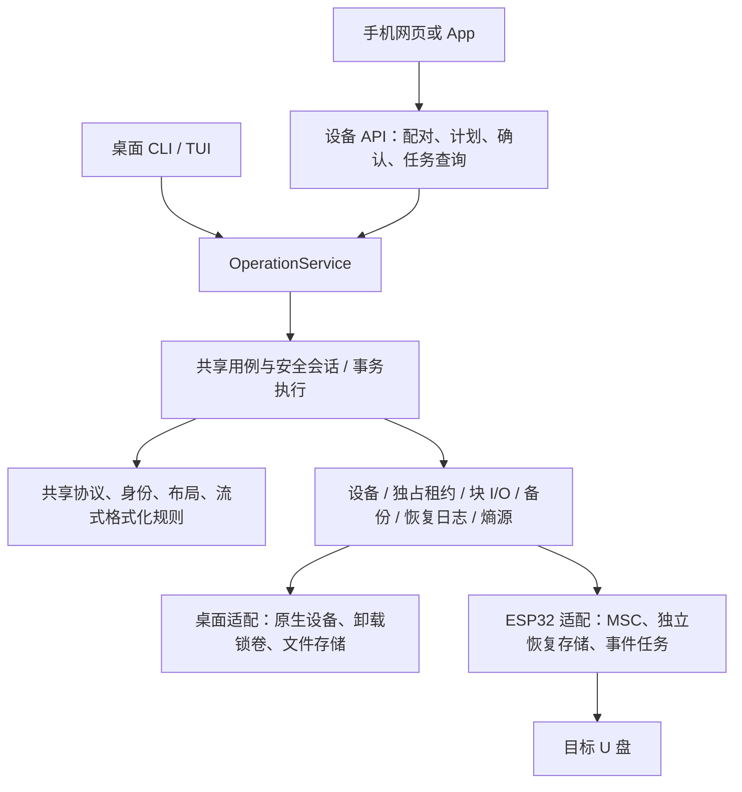

# 手机遥控 ESP32 制盘：架构审计与改进建议

审计日期：2026-10-07（Asia/Shanghai）。基线 HEAD：`6b56da5e9508a18939ffa167c2115bb3e45e8dc1`，实际对象为包含未提交修改的当前工作区。审计开始时已有制盘、TUI、协议和测试修改；本轮只增加审计证据，不修改产品实现。

本文是面向未来能力的审计快照，所有建议接口、模块、状态与路线均**尚未实现**。当前行为仍以 [架构规范](../../docs/architecture/ARCHITECTURE.md)、[制盘规范](../../docs/provisioning/PROVISIONING.md) 和代码为准。

## 结论与目标假设

现有架构适合作为共用制盘核心的起点，但不能仅增加 Wi-Fi 或替换 `SectorDev` 就得到独立 ESP32 制盘器。最优先的改进是：设备能力与桌面命令解耦、格式化计划流式生成、可持久化的写入恢复机制、脱离前端生命周期的任务服务。手机界面随后接入这些能力。

用户已确认尚未选板，目标是脱离电脑独立制盘。本报告按“手机负责配置、预览、确认和观察；U 盘直接接 ESP32；ESP32 独立制盘；正常运行无需电脑”评估。桌面服务可以先验证共用交互契约，但不能作为独立制盘目标的完成标准。

建议首个硬件候选使用带 PSRAM、可提供受保护 5V VBUS、具备独立恢复存储的 ESP32-S3 板。S3 支持全速 USB OTG Host；官方资料确认 S2/S3 可作为 MSC Host 访问 U 盘。全速信号速率为 12Mbit/s，实际制盘耗时必须实测，不能套用其他芯片的性能示例。[乐鑫 USB FAQ](https://docs.espressif.com/projects/esp-faq/en/latest/software-framework/peripherals/usb.html)、[USB Host 文档](https://docs.espressif.com/projects/esp-idf/en/latest/esp32s3/api-reference/peripherals/usb_host.html)。

这只是硬件候选，尚未证明 EDP 介质兼容、缓存落盘语义或掉电恢复可靠。S3 芯片具有 512KB SRAM；外部 PSRAM 不消除当前几十 MiB 计划和回滚副本的问题。[S3 数据手册](https://documentation.espressif.com/esp32_s3_datasheet_en.pdf)。

## 已有架构中值得保留的部分

| 能力 | 当前证据 | 后续用途 |
| --- | --- | --- |
| 纯协议解析、布局、密钥处理和镜像生成 | [protocol](../../src/protocol/mod.rs)、[provision](../../src/provision/mod.rs) | 桌面和固件共用协议事实与生成规则，避免另写一套 C 制盘算法 |
| CLI/TUI 共用准备、提交、导出服务 | [制盘应用层](../../src/application/provision.rs)，`prepare_provision_on_disk` / `commit_provision_with_backup_on_disk_with_progress` | 手机作为新增前端，继续复用用例而非调用终端文本 |
| 显式写入状态转换与独占借用 | [TargetSession](../../src/application/target_session.rs)，第 70–122 行 | 保留“只读→写准备→身份复核→独占写入”的不变量 |
| 来源绑定的强制备份证明 | [制盘应用层](../../src/application/provision.rs)，第 714–842 行 | 保留未完成验证备份不能进入真实提交的约束 |
| 阶段顺序、同步、逐扇区读回与失败回滚 | [事务执行器](../../src/diskio/transaction.rs)，第 228–324 行 | 演进为有界内存、持久化恢复的共用执行器 |
| 结构化进度与介质状态 | [progress](../../src/application/progress.rs)、[OperationError](../../src/application/error.rs) | 投影为网络事件与机器可读结果 |
| 金标、协议、事务、架构和实体 HIL 门禁 | [tests](../../tests/provision_suite.rs)、[实体 HIL 规范](../../docs/architecture/PHYSICAL_HIL_GOVERNANCE.md) | 作为跨端一致性和硬件适配的验收基础 |

## 主要发现

优先级针对未来“独立联网制盘器”的实现与发布阻碍，不代表现有本地 CLI 存在同等级缺陷。

### A1：设备和安全会话仍依赖桌面系统，属于首要移植阻碍

`SectorDev` 抽象了扇区操作，但 `TargetSession` 仍保存 `CmdRunner` 与 `disk: u32`，直接调用 `platform::system::{device_geometry,prepare_write,disk_total_sectors}` 并持有具体 `WriteGuard`。`prepare_provision_on_disk` 和真实提交仍打开 `FileDev`；备份验证打开本地路径。见 [ports](../../src/ports.rs) 第 20–28 行、[设备入口](../../src/application/device.rs) 第 10–46 行、[写入会话](../../src/application/target_session.rs) 第 56–122 行。

ESP32 没有桌面磁盘编号、`diskutil` 或 sudo。把这些命令模拟进 `CmdRunner` 会让固件承担桌面兼容层，也容易遗漏卸载和身份保护。

**建议：**以设备能力而非命令执行器作为应用层依赖：设备发现/观察、独占写租约、块设备读写、备份存储、恢复日志、时间与熵源。桌面适配器执行系统盘保护、卸载和锁卷；ESP32 适配器只允许外接 USB MSC LUN，并确保该介质没有同时通过 VFS/FatFS 访问。两者都在进入写入时复核身份、容量、逻辑扇区大小和连接代次。

USB 地址可在重插后复用，不能当稳定身份。新增 `DeviceRef` 应包含执行器身份、启动代次、连接代次与 LUN；`MediaIdentityPin` 继续绑定硬件和来源协议快照。拔盘重插必须使旧租约和计划失效，即使 VID/PID 相同。

### A2：格式化和回滚按写集大小占内存，属于首要资源阻碍

`FormatPlan.writes` 是 `Vec<FilesystemWrite>`；FAT32 构建器把两份 FAT 的每个扇区，包括零扇区，插入 `BTreeMap`；exFAT 构建完整 FAT 字节数组和位图。`SparseFilesystemImage` 物化全部写入扇区，加密转换生成另一集合。官方准备还同时保留物理镜像与验证镜像。提交把扇区复制到事务，事务再复制写集并读取全部旧扇区到内存镜像。

证据：[格式化模型](../../src/filesystem/format.rs) 第 38–49 行、[FAT32](../../src/filesystem/fat32.rs) 第 453–480 行、[exFAT](../../src/filesystem/exfat.rs) 第 673–726 行、[镜像转换](../../src/filesystem/image.rs) 第 53–61 行、[格式化准备](../../src/application/provision/format_plan.rs)、[格式化提交](../../src/application/filesystem_format.rs)、[事务副本](../../src/diskio/transaction.rs) 第 220–224、270–295 行。

本轮直接调用当前编译库的 `build_empty_filesystem_typed`，只生成内存镜像，不打开设备。结果如下，完整数据保存在 [探针结果](20261007-mobile-esp32-format-memory.csv)。

| 文件系统 | 分区大小 | 物化扇区数 | 单份扇区有效载荷 |
| --- | ---: | ---: | ---: |
| FAT32 | 512MiB | 16,389 | 8,391,168B，约 8.00MiB |
| FAT32 | 8GiB | 65,544 | 33,558,528B，约 32.00MiB |
| exFAT | 512MiB | 584 | 299,008B，约 292KiB |
| exFAT | 8GiB | 2,264 | 1,159,168B，约 1.11MiB |
| exFAT | 32GiB | 8,600 | 4,403,200B，约 4.20MiB |

这些数字是扇区数×512，不是堆峰值，也未计入集合节点、镜像副本、回滚旧数据、协议、Wi-Fi、TLS 和任务栈。不能以“镜像是稀疏的”推断它适合微控制器。

**建议：**计划保存布局、写入范围和确定性生成规则，执行时按固定大小缓冲区生成扇区。支持 `Literal`、`Fill`、`Generated`、`Transform` 等内部表达；连续扇区批量提交，阶段边界保持原有顺序和同步要求。加密零区必须逐扇区生成正确密文，不能跳过写入。对写入范围、扇区数、恢复存储和内存预算在首次写入前做预检。

流式化不能把整体回滚缩水为“只回滚最后一块”。若仍承诺恢复本次格式化全部 touched sectors，就必须在独立存储保存其全部旧内容；空间不足应在写前拒绝，或提供明确、单独授权的较弱恢复模式。先保持现有语义。

### A3：当前回滚不覆盖掉电，独立制盘器需要持久化恢复

当前事务的 `mirror` 存在 RAM 中，写入或同步失败时最多尝试三次回滚；进程崩溃、看门狗复位或电源中断后，这份镜像不存在。现有 `.edpb` 是协议/分区表等 `metadata_only` 备份，不含 FAT、位图和用户文件，不能替代格式化 touched sectors 的撤销日志。见 [事务](../../src/diskio/transaction.rs) 第 272–318 行、[备份规范](../../docs/backup/EDPB_FORMAT.md)。

**建议：**单独引入 `RecoveryJournal`，存于板载恢复分区、独立 Flash 或 SD 卡，避免保存在即将重制的目标 U 盘上。日志绑定操作、计划摘要、介质 pin、事务范围和版本；先持久化旧扇区及校验，再允许覆盖对应目标范围。记录阶段意图、完成记录与完整性校验，采用能识别撕裂写入的发布方式。

重启发现未闭合日志，进入恢复检查；重新验证原介质后才能执行受控回滚。首版优先支持恢复/回滚，不自动续写剩余制盘步骤。不能仅凭一个 `Writing` 标记判定哪些扇区已落盘，也不能看到 `Completed` 就跳过对日志完整性的校验。具体 Flash/SD 落盘顺序须通过掉电注入验证，无法承诺硬件跨扇区原子性。

官方制盘目前先提交协议，再逐分区格式化；每次格式化是独立事务。日志要记录这些提交边界。某个分区回滚成功，仅表示该分区本次 touched sectors 恢复到格式化前，不表示已经提交的协议和前面分区被撤销。

### A4：任务生命周期仍在 TUI 内，手机重试和重连没有共用契约

`TaskHub` 实现线程、通道、单操作门禁和从零开始的进程内 `OperationId`；它位于 `src/tui`。`ProgressEvent` 有阶段和工作量，但包含 `Instant`，没有可重放事件序号和持久化操作身份。当前前端生命周期足以服务终端，不能直接承担多个手机连接、请求超时重试和设备重启后的查询。见 [TaskHub](../../src/tui/task.rs) 第 225–305 行、[进度模型](../../src/application/progress.rs) 第 299–311 行。

**建议：**新增与 UI 无关的 `OperationService`，把关键任务门禁和状态机迁入执行端。CLI/TUI/手机只订阅、提交请求和显示结果。单个 USB 写任务独占设备；查询进度不重新扫描正在写入的盘。

提交使用 `request_id` / 幂等键和计划摘要；同键同内容返回同一 `operation_id`，同键不同内容拒绝。映射须在首个写入前持久化；响应丢失后重试不能再次制盘。操作 ID 跨重启不冲突，并明确绑定执行器身份。

网络断开只是观察者断开。ESP32 已接受的写任务继续完成或执行既定回滚，不能依赖 WebSocket 存活。取消仅在安全检查点生效；底层 I/O 超时、拔盘和电源故障分别处理，不能用断网事件代替 USB 故障。

### A5：现有 USB/SCSI 身份和同步要求需要固件侧证明

EDP `device_id` 不是简单的 VID/PID；当前推导还使用 SCSI INQUIRY vendor/product/revision、BOT/UAS 与 Windows PnP 兼容规则。USB 描述符 `iManufacturer/iProduct` 不能直接替代 SCSI INQUIRY 字段。见 [身份推导](../../src/identify.rs)、[TargetIdentity](../../src/provision/spec.rs)、[硬件模型](../../src/domain/hardware.rs)。

官方 `usb_host_msc` 1.3.0 说明只支持 BOT + Transparent SCSI；首版应明确只接收已验证的 BOT 介质，不承诺 UAS-only 设备。官方 `msc_host_device_info_t` 暴露 VID/PID、容量、块大小和 USB 描述符字符串，未提供当前 edpcli 需要的完整 SCSI 身份值；其序列号数组也有长度上限。[组件说明](https://components.espressif.com/components/espressif/usb_host_msc/versions/1.3.0/readme)、[固定版本头文件](https://raw.githubusercontent.com/espressif/esp-usb/8ab282ac6cde1970b660fc032b2d33a9c70e8d07/host/class/msc/usb_host_msc/include/usb/msc_host.h)。

同一头文件把旧原始扇区 API 标为弃用；blockdev 入口受 `ESP_IDF_VERSION >= 6.0.4` 条件控制。私有 SCSI 头文件虽声明 INQUIRY，但没有输出身份参数，也未声明 SYNCHRONIZE CACHE；这些接口不足以证明所需能力已经完整可用。[私有 SCSI 头文件](https://raw.githubusercontent.com/espressif/esp-usb/8ab282ac6cde1970b660fc032b2d33a9c70e8d07/host/class/msc/usb_host_msc/include/esp_private/msc_scsi_bot.h)。

**建议：**锁定实际选用的 ESP-IDF、MSC 组件及 Rust 工具链版本，建立一个薄适配层，验证如何取得完整 SCSI INQUIRY、可靠序列号、容量/块大小和设备缓存同步结果。不支持的同步不能实现成返回成功的空函数；需要经验证的降级策略或拒绝写入。命令成功和读回一致不能证明所有 U 盘在掉电后都保存了数据。

对同一 U 盘在桌面与 ESP32 BOT 环境采集身份，并解释 BOT/UAS 导致的合法推导差异；已有盘应区分来源协议 `device_id` 和目标硬件身份，不能盲目假设跨传输模式字节完全相同。缺失或截断的序列号必须保留证据质量，不伪造稳定身份。

### A6：单 crate 仍将前端依赖带入固件构建，边界需要编译验证

当前 Cargo 无 workspace，`ratatui/crossterm` 等为无条件依赖；`lib.rs` 无条件公开 CLI/TUI/platform，平台实现只选择 macOS/Linux/Windows。`ports` 使用 `std::io/Duration`；事务使用线程休眠和 panic 捕获；秘密擦除依赖 `std`。目录分层已经有价值，但不是固件可构建的保证。见 [Cargo.toml](../../Cargo.toml)、[lib.rs](../../src/lib.rs)、[platform](../../src/platform/mod.rs)、[secret](../../src/domain/secret.rs)、[架构门禁](../../tests/architecture_dependencies.rs)。

**建议：**先在现有模块内建立可移植依赖边界，再拆最小 workspace：`core` 保存协议/身份/布局/文件系统生成规则；`engine` 保存用例/会话/事务/操作服务；`host` 保存现有桌面适配和 CLI/TUI；固件工程保存 ESP-IDF/MSC/存储/网络适配。只有形成明确依赖后再决定 API DTO 是否独立 crate。

首版可优先验证 Rust + ESP-IDF 的可移植 `std` 子集，驱动经薄 C FFI 适配；不把全仓 `no_std` 化当先决条件。若目标工具链或依赖不支持，再针对核心采用 `core + alloc`。必须建立真实目标编译门禁和内存上限；不能以桌面测试通过代替固件编译、驱动语义和 HIL。

## 建议目标架构



该图表示同一核心的两个执行端，不表示独立制盘时必须经过电脑。设备 API 和手机通过控制平面交互，扇区写入留在实际连接 U 盘的执行端；不把每个扇区读写通过手机逐次 RPC。

建议先在 `ports` 形成以下职责契约，具体类型名可在实现时调整：

| 边界 | 输入/输出与必须保障的事实 |
| --- | --- |
| `DeviceProvider` | 列举可操作介质、观察完整硬件证据/几何/连接代次；设备路径仅属于桌面适配 |
| `WriteLease` | 执行目标保护、排除并行访问、重新观察并绑定独占句柄；在关键写入期间保持存活 |
| `BlockDevice` | 调用者提供缓冲区的批量读写、明确同步语义、错误分类和有界等待；生命周期重开属于租约而非块 I/O |
| `WriteRecipe` | 确定性、可多次遍历、范围互斥且有界的扇区生成规则；物理偏移和加密约束保持一致 |
| `BackupStore` | 创建、发布、重新验证来源绑定备份；不向核心暴露路径；EDPB v3 编解码与宿主文件 I/O 分离 |
| `RecoveryJournal` | 完整保存本次事务旧内容、持久化检查点、恢复校验；与元数据备份职责分开 |
| `EntropySource` / `Clock` | 设备安全随机数与时间能力；预览后执行不重新随机生成另一个计划；时间未知作为显式状态 |

对外几何可用 `u64`，但当前 EDP/MBR 和事务写入上限继续保留并统一验证；加宽 API 不意味着支持大盘或非 512B 逻辑块。桌面与固件以能力对象给出模式、文件系统、最大范围、内存/恢复存储预算和同步支持，手机根据能力显示可选项。

格式化验证的迁移还应区分“验证生成规则”和“验证真实介质”。目前深度文件系统检查读取 `PreparedImageReader`，物理扇区一致性由底层事务读回负责；这不是完全没有读回。流式重构后建议增加经过分区解密映射的真实介质 reader，确保文件系统验证和物理写后检查继续闭合，避免只校验准备好的模板。见 [格式化验证](../../src/application/provision/commit/partition_format.rs)。

## 手机交互与设备任务契约

首版建议设备提供轻量网页，手机无需安装原生 App；先验证网页连接、配对与写任务独立性，再决定是否需要 PWA 或原生 UI。下面仅是拟议 API，不是已支持命令：

| 请求 | 行为 |
| --- | --- |
| `GET /v1/capabilities` | 获取版本、模式、文件系统、资源和恢复能力 |
| `GET /v1/devices` | 获取安全目标与证据质量；不暴露宿主裸盘路径作为授权 |
| `POST /v1/plans` | 根据完整配置和目标生成只读计划，返回 `plan_id`、摘要、布局、破坏范围、备份/恢复预算 |
| `POST /v1/operations` | 用计划 ID、摘要、一次性确认凭据和幂等键提交；返回同一任务的可查询 ID |
| `GET /v1/operations/{id}` | 返回权威状态、当前阶段、各分区结果和介质状态 |
| `GET /v1/operations/{id}/events?after={seq}` | 获取增量事件；过期游标回退到完整快照，可用 SSE/WebSocket 承载 |
| `POST /v1/operations/{id}/cancel` | 请求安全取消；返回何时可执行，关键事务内延迟到安全检查点 |
| `GET /v1/backups/{id}` | 经授权下载元数据备份；下载到手机不是运行时恢复存储的替代品 |

手机只提交配置；设备生成并持有不可变计划及秘密材料，客户端不能提交任意 LBA patch。计划绑定目标 pin、连接代次、配置、固件/算法版本、格式化步骤与资源预算；摘要使用有版本的规范化编码。计划过期、目标变化、固件重启或配置变化后，重新生成预览与确认。授权也要绑定计划摘要和执行器启动代次。

拟议任务状态：

```text
Planning → AwaitingConfirmation → BackingUp → VerifyingBackup → AcquiringLease
→ Revalidating → WritingProtocol → VerifyingProtocol
→ FormattingPartition[n] → VerifyingPartition[n] → Completed

失败可进入：RollingBack、FailedRolledBack、PartialFailure、RecoveryRequired
设备重启且日志未闭合：RecoveryInspection（拒绝新写任务）
```

权威结果同时表达协议是否已提交、每个分区成功/失败/未执行、回滚作用范围、介质 `Unchanged/RolledBack/Intermediate/Unknown`、备份引用与恢复要求。工作量 100% 或收到 `Complete` 事件不等于业务成功；沿用现有 `ProvisionExecutionStatus` 的分阶段语义。

`operation_id + seq` 区分任务与事件；普通进度可合并，边界、错误和最终结果可靠保留。设备查询返回最新快照；断线重连补事件或取快照，不重新提交计划。事件有界保留并报告最早可重放序号。持久化内容避免包含密码和明文密钥；重启后的恢复只依赖必要日志，重新续作需要重新授权。

联网后增加新的授权边界：首次物理配对或一次性配对码、设备会话身份、版本化请求和有界消息、认证的加密传输。浏览器入口还需来源校验，避免其他页面代用户发起制盘；密码不进入 URL、日志、进度或普通持久化 DTO。板上提供本地状态指示，手机熄屏后仍能观察设备是否在写入/恢复。Wi-Fi AP 或局域网模式可以分阶段选择，均不改变任务归设备持有的原则。

## 分阶段实现及验收

| 阶段 | 建议改动 | 完成标准 |
| --- | --- | --- |
| 0：硬件可行性探针 | 锁定板与 SDK；MSC 原始读写、INQUIRY、容量、序列号、同步、拔插、供电与超时验证 | 指定测试 U 盘的身份/512B 几何可解释；受控测试介质完成写→同步→读回；不支持项明确拒绝 |
| 1：解耦宿主能力 | 优先修改 `ports`、`application/device`、`target_session`、制盘准备/提交和备份入口；提取纯身份计算 | 桌面行为保持；同一用例能通过内存适配器执行；核心不调用平台命令、路径或 UI；固件核心目标可编译 |
| 2：有界计划与恢复 | 修改 FAT/exFAT、`FormatPlan`、镜像转换、事务执行；增加独立日志与资源预检 | 固定缓冲区执行大分区；与旧实现逐扇区一致；日志满在首次写前失败；写/同步/日志各边界故障可判定恢复范围 |
| 3：操作服务和网络契约 | 从 TUI 提取门禁/任务身份；定义 DTO、快照、事件、确认和幂等 | 重复点击/丢响应仅执行一次；两个客户端不能同时制盘；断网不停止关键写任务；重启使旧确认失效 |
| 4：ESP32 制盘最小闭环 | 适配 MSC、备份/日志存储与安全随机；接手机网页 | 从只读识别/计划开始，再覆盖一个经过金标和 HIL 的目标；无电脑完成预览→确认→备份→制盘→读回→查询 |
| 5：扩大能力 | 加入其他官方模式、加密分区、保留/重包密钥、恢复后流程等 | 各能力分别通过跨端一致性、资源预算和 HIL，按设备能力发布 |

阶段 0 的身份和缓存同步探针可先于大规模拆 crate，尽早排除驱动/硬件阻碍。首个写入目标由真实样本和资源测试决定；可先验证 Plain 或 mode0，但必须保留“仅支持已验收子集”的能力声明，不默认固件具备桌面五种目标全部功能。

推荐下一次代码改动从阶段 1 的**设备观察和独占写租约**开始，保留 `TargetSession` 安全不变量，先让桌面全部写路径通过新能力。仅先加 HTTP 会留下主要执行耦合，难以检验是否可独立制盘。

## 验证证据、候选处置与限制

- `scripts/test-fast.sh`：通过。格式、diff、Clippy、变更分类与 table-scroll 前置门禁通过；8 个 suite / 10 个 artifact / 0 失败，runner 用时 36.89 秒。这是已有工作区基线验证，不是 ESP32 验收。
- `python3 scripts/audit-redundancy.py --check`：初次扫描 729 个文件；13 条规则，确认问题 0，候选 180。候选逐条保留原规则、路径、符号与检测证据，并记录在 [处置清单](20261007-mobile-esp32-redundancy-disposition.tsv)。本轮不删除代码，不把只在测试调用、转发或无人调用的公开入口当成缺陷。
- 增加三份审计产物后重跑全仓冗余检查：732 个文件，确认问题仍为 0，候选仍为 180；没有断开的文档链接、缺失模块或已退休符号复现。`cargo test --locked --test repository_suite documentation_layout` 的 7 个文档契约测试通过；`git diff --check` 与 180 行处置清单、8 行探针数据一致性检查通过。
- 其中两个无人调用候选是 `backup_prepared_provision_on_disk` 与 `commit_provision_on_disk`：它们与来源绑定备份证明有关，可作为后续拆分 prepare/backup/commit 边界的评估入口，保留并在提取操作服务时决定 API 归属。
- FAT32/exFAT 内存探针基于当前库执行；原始临时探针位于 `target/architecture-audit/`，结果表随本报告保留。它统计物化有效载荷，不测 MCU SRAM 峰值、DMA 内存或耗时。
- 没有启用虚拟或真实 HIL，没有访问、写入或格式化真实 U 盘，没有安装二进制，也没有提交或发布。本次是审计，没有宽范围实现重构，因此未额外运行 full；后续合并/发布及宽范围重构按仓库规范执行 full，硬件门禁独立运行。
- 固件工具链、完整 SCSI 身份获取、缓存同步、具体日志介质掉电行为、真实吞吐和 Wi-Fi 并发下内存峰值尚未验证，属于阶段 0/2/4 的验收事项。
- 不新增冗余检测规则：本轮发现的是宿主耦合、资源增长和恢复/任务契约缺口，不是新的代码冗余类别。

## 内存探针复现说明

临时独立 Rust 程序链接 fast gate 构建出的当前 `edpcli` 库；枚举 FAT32/exFAT 与 512、8192、32768、131072MiB，调用以下核心逻辑：

```rust
let image = edpcli::application::filesystem::build_empty_filesystem_typed(
    filesystem, 2048, volume_mib * 2048, 0x12345678, Some("AUDIT"),
)?;
let touched_sectors = image.sectors().len();
let payload_bytes = touched_sectors * 512;
```

运行它只进行协议/文件系统内存计算，不创建盘镜像文件或设备句柄。该证据用于说明物化规模；流式实现的验收需继续与旧生成器完整写集合及加密物理扇区逐字节比对。
